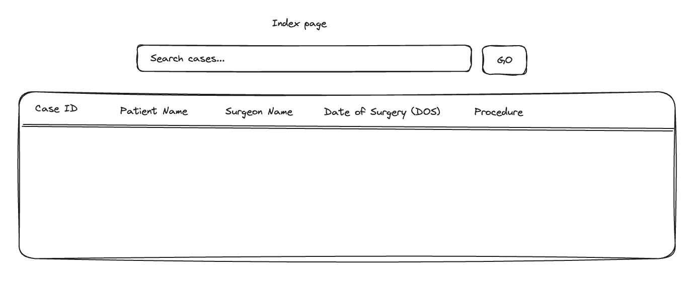
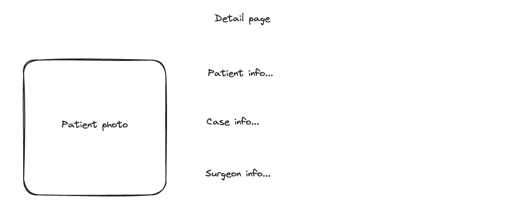

# Procision Surgical Case Data Code Challenge

## Overview

- Clone the repo
- Implement the solution
- Test and document your solution as appropriate
- Provide a link to your repo
- Expect to discuss the solution with us

## Problem

Using the provided project implement the following fullstack application:

- An index page [see diagram below](#index-page) that lists cases. See the wireframe for how this should look and fields to display on the index.
- A search field that filters the list by patient name or case ID.
- A case detail page [see diagram below](#detail-page) that displays details on case, patient, and surgeon for a given case. Clicking on an item in the index should take you to the detail page.
- Use data from [./data/cases.json](./data/cases.json) to populate these pages.

### Data model

The provided data is composed of:

- SurgicalCase: A surgical procedures performed in an operating room on an individual.
- Patient: A person receiving or who will receive medical care, in this case a surgical case.
- Surgeon: A physician who will administer medical care to a patient as part of a surgical case.

###  Index Page

###  Detail Page

Creating this application will require implementing a react UI along with APIs to source the data.

## Tech stack

This provided repo is setup with a tech stack similar to what we’re using. Below are links to the relevant technologies contained within.

- [Next.js](https://nextjs.org)
- [Prisma](https://prisma.io)
- [Tailwind CSS](https://tailwindcss.com)
- [tRPC](https://trpc.io)

While we have suggested a stack based on what we use, you may prefer other technologies such as a different UI library, API paradigm such as graphql, etc. You can use what you prefer but please come prepared to explain your choices. Using all or most of our stack gives us the opportunity to evaluate your skills in these technologies.

## Setup

## Project
- Clone the repo from github
- Run `npm install` to install dependencies

### Next.js

- Create a `.env` file at the root level to provide any required environment variables to run the application.
  - Use the `.env.example` file as an example to work from. It already includes a SQLite connnection string.
  - NOTE: Environment variables are validated within the `./src/env.js` file and any new ones need to be added there as well.
- This is currently setup to use the pages router. You may use the app router if you prefer.
- To run the app locally use `npm run dev`.

### Prisma

- Prisma is currently setup to use a local SQLite db.
- Modify the example db schema at [./prisma/schema.prisma](./prisma/schema.prisma).
- Update the example seed script at [./prisma/seed.ts](./prisma/seed.ts) to import case data into the db.
- Use `npm run db:push` to push schema changes to the local db.
- Use `npm run db:seed` to seed data into the local db.
- Use `npm run db:studio` to start Prisma Studio that can be used to explore the local db.

### tRPC

- Additional api routes can be added in the [./src/server/api/routers](./src/server/api/routers) folder.
- Any new routes must be added to the root router at [./src/server/api/root.ts](./src/server/api/root.ts).

To make it easier to present your finished application, it can be hosted on [Vercel](https://nextjs.org/learn-pages-router/basics/deploying-nextjs-app/deploy) or another provider of your choice.

## Optional bonuses (especially encouraged for takehome interviews):

- Develop the ability to create new cases and patients.
- Develop the ability to edit a case or patient.
- Implement the search field as an auto-complete.
- Enhance the search to be AI powered using the [TypeChat](https://microsoft.github.io/TypeChat/) library. The accompanying documentation and [examples](https://microsoft.github.io/TypeChat/docs/examples/) on their GitHub should give you clear direction. _Note this will require an OpenAI API key._
